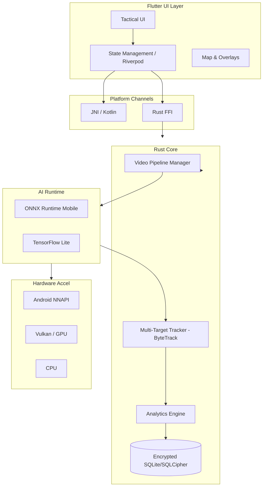

# Oko Saurona - Architecture

```mermaid
graph TD
    subgraph Frontend [Flutter UI Layer]
        UI[Tactical UI]
        State[State Management / Riverpod]
        Map[Map & Overlays]
    end

    subgraph NativeBridge [Platform Channels]
        JNI[JNI / Kotlin]
        FFI[Rust FFI]
    end

    subgraph CoreBackend [Rust Core]
        Pipeline[Video Pipeline Manager]
        Tracker[Multi-Target Tracker - ByteTrack]
        Analytics[Analytics Engine]
        DB[(Encrypted SQLite/SQLCipher)]
    end

    subgraph InferenceEngine [AI Runtime]
        ORT[ONNX Runtime Mobile]
        TFL[TensorFlow Lite]
    end

    subgraph Hardware [Hardware Accel]
        NNAPI[Android NNAPI]
        Vulkan[Vulkan / GPU]
        CPU[CPU]
    end

    UI --> State
    State --> FFI
    State --> JNI
    FFI --> CoreBackend
    CoreBackend --> Pipeline
    Pipeline --> InferenceEngine
    InferenceEngine --> Hardware
    InferenceEngine --> Tracker
    Tracker --> Analytics
    Analytics --> DB
```
